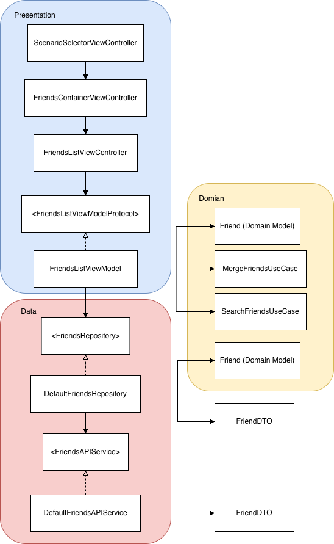

# FriendsListInterview

一個 iOS 面試作業專案，示範 **UIKit + MVVM 架構設計**、清楚的分層責任，以及以狀態驅動 UI 呈現的好友列表功能。

本專案的重點不在功能完整度，而在於 **架構清晰度、可維護性與可測試性**。

---

## 功能特色

- 好友列表多情境顯示：
  - 無好友（Empty State）
  - 僅好友列表
  - 好友列表 + 邀請卡片
- 可展開 / 收合的好友邀請卡（CollectionView）
- 好友搜尋功能（支援搜尋置頂 / 還原）
- 自訂 Header 與 ToolsBar，取代系統 NavigationBar
- 以 ViewModel 狀態驅動 UI 呈現
- 全程使用 UIKit + Auto Layout（無 Storyboard）
- 單元測試與 Coverage 設定完成

---

## 架構概覽

本專案採用 **MVVM + Clean Architecture** 的分層設計，主要分為三層：

- **Presentation（表現層）**：UI 與使用者互動
- **Domain（領域層）**：商業邏輯與 UseCase
- **Data（資料層）**：資料取得與轉換

高層結構如下：
```
Presentation
 └─ ViewController
 └─ ViewModel (via protocol)

Domain
 └─ UseCases
 └─ Domain Models

Data
 └─ Repository (via protocol)
 └─ API Service (via protocol)
```

---

## 高階設計（HLD）

<p align="center">
  
</p>

HLD UML 圖說明了以下設計原則：

- ViewController **僅依賴 ViewModel Protocol**
- ViewModel 負責調用 Domain UseCases
- Repository 依賴抽象的 API Service Protocol
- 具體實作（DefaultXXX）以空心箭頭表示「實作 / 遵循協議」

> 內部 UI 狀態（例如 empty / content）屬於 ViewModel 的狀態管理，不視為架構實體，因此未納入 HLD 圖中，以保持架構圖的清晰與抽象層級一致。

---

## Presentation Layer（表現層）

### View Controllers

- `ScenarioSelectorViewController`  
  作為 Demo 入口，用於切換不同好友情境（面試展示用途）。

- `FriendsContainerViewController`  
  負責整體畫面容器：
  - 自訂 Header（取代系統 NavigationBar）
  - 內嵌內容 ViewController
  - 底部 TabBar

- `FriendsListViewController`  
  負責：
  - 好友列表 UI 呈現
  - 與 ViewModel 綁定狀態
  - Empty / Content UI 切換
  - 搜尋與滾動互動行為

---

### ViewModel

- `FriendsListViewModel`
- 遵循 `FriendsListViewModelProtocol`

主要職責：
- 載入與轉換資料
- 管理 UI 狀態（Loading / Empty / Content）
- 透過 callback 通知 ViewController 更新畫面

ViewController 僅依賴 Protocol，有以下好處：
- 易於單元測試
- 降低耦合
- 可替換實作或 Mock

---

## Domain Layer（領域層）

Domain 層只包含**純商業邏輯**，不依賴 UIKit 或資料來源。

### Domain Model

- `Friend`  
  核心業務模型，供 UseCase 與 ViewModel 使用。

### UseCases

- `MergeFriendsUseCase`  
  將好友與邀請資料合併為統一的 Domain Model。

- `SearchFriendsUseCase`  
  封裝好友搜尋邏輯，避免搜尋規則散落於 UI。

---

## Data Layer（資料層）

### Repository

- `FriendsRepository`（Protocol）
- `DefaultFriendsRepository`（實作）

職責：
- 透過 API Service 取得資料
- 將 DTO 轉換為 Domain Model
- 對上層隱藏資料來源細節

Repository 僅依賴 **抽象的 API Service Protocol**。

---

### API Service

- `FriendsAPIService`（Protocol）
- `DefaultFriendsAPIService`（實作）

職責：
- 發送網路請求
- 將 API 回傳資料解析為 DTO

具體 Service 以「實作協議」方式存在，利於：
- Mock
- 測試
- 未來替換實作

---

## 狀態管理說明

UI 顯示完全由 ViewModel 狀態驅動，例如：

- Loading
- Empty
- Content（有 / 無邀請）

這些狀態為 ViewModel 內部實作細節，**不作為架構元件呈現在 HLD**，以保持架構層級的清晰度。

---

## UI 實作重點

- 純 UIKit + Auto Layout
- 使用自訂 ToolsBar 取代 NavigationBar
- Empty State 使用 `tableView.backgroundView`
- 搜尋列支援捲動置頂 / 還原
- 版面調整以 Constraint 動畫實作

---

## 測試

- 已建立 Unit Tests
- Xcode Scheme 已開啟 Code Coverage
- 測試範圍包含：
  - ViewModel 邏輯
  - Repository 行為
  - UseCase 正確性

Coverage 可於 **Xcode → Test Navigator → Coverage** 查看。

---

## 專案設計重點

本專案著重於：

- 架構清晰度
- Dependency Inversion
- 狀態驅動 UI
- 可維護的 UIKit 實作

而非商業功能完整度。

---

## 作者

**Chao Ming Huang**  
iOS Engineer（UIKit / Swift）

---

# FriendsListInterview

An iOS interview assignment that demonstrates **UIKit-based MVVM architecture**, clean layering, and state-driven UI rendering for a friends list feature.

This project focuses on **clarity of architecture**, **separation of concerns**, and **maintainable UI logic**, rather than feature completeness.

---

## Features

- Friend list with multiple UI scenarios:
  - Empty state
  - Friends only
  - Friends with invitations
- Collapsible invitation cards (CollectionView)
- Search friends with pinned search behavior
- Custom header & toolbar replacing default navigation bar
- State-driven UI rendering via ViewModel
- Fully programmatic UI (UIKit, Auto Layout)
- Unit tests with coverage enabled

---

## Architecture Overview

The project follows a **layered MVVM + Clean Architecture approach**, divided into three main layers:

- **Presentation** – UI and user interaction
- **Domain** – Business logic and use cases
- **Data** – Data fetching and mapping

High-level structure:

```
Presentation
 └─ ViewController
 └─ ViewModel (via protocol)

Domain
 └─ UseCases
 └─ Domain Models

Data
 └─ Repository (via protocol)
 └─ API Service (via protocol)
```
 
### High-Level Design (HLD)

<p align="center">
  
</p>

The architecture is illustrated in the HLD UML diagram:

- ViewControllers depend only on **ViewModel protocols**
- ViewModels depend on **Domain UseCases**
- Repositories depend on **abstract API service protocols**
- Concrete implementations realize protocols via dependency injection

> Internal UI states (such as empty or content scenarios) are intentionally omitted from the HLD diagram, as they are internal ViewModel state representations rather than architectural components.

---

## Presentation Layer

### View Controllers

- `ScenarioSelectorViewController`  
  Entry point for switching demo scenarios (for interview/testing purposes).

- `FriendsContainerViewController`  
  Acts as a layout container:
  - Custom header (replacing NavigationBar)
  - Content ViewController embedding
  - Bottom tab bar

- `FriendsListViewController`  
  Responsible for:
  - Rendering friend list UI
  - Binding ViewModel state to UI
  - Managing empty / content presentation
  - Handling search and scroll-driven layout changes

### ViewModel

- `FriendsListViewModel`
- Conforms to `FriendsListViewModelProtocol`

Responsibilities:
- Load and transform data for presentation
- Manage UI state transitions
- Expose state changes to the ViewController via callbacks

The ViewController depends **only on the protocol**, allowing:
- Easier testing
- Clear dependency boundaries
- ViewModel replacement or mocking

---

## Domain Layer

The Domain layer contains **pure business logic** and is UI-agnostic.

### Domain Model

- `Friend`  
  Represents the core business entity used across the app.

### Use Cases

- `MergeFriendsUseCase`  
  Combines friend lists and invitation data into a unified domain representation.

- `SearchFriendsUseCase`  
  Encapsulates search logic for filtering friends by keyword.

UseCases are injected into the ViewModel and return Domain Models only.

---

## Data Layer

The Data layer is responsible for data retrieval and mapping.

### Repository

- `FriendsRepository` (protocol)
- `DefaultFriendsRepository` (implementation)

Responsibilities:
- Fetch raw data via API services
- Convert DTOs into Domain Models
- Hide data source details from upper layers

The repository **depends on an abstract API service protocol**, not a concrete implementation.

### API Service

- `FriendsAPIService` (protocol)
- `DefaultFriendsAPIService` (implementation)

Responsibilities:
- Perform network requests
- Decode API responses into DTOs

Concrete services **realize** the service protocol, enabling:
- Easy replacement
- Mocking for unit tests
- Decoupling from networking details

---

## State Management

UI rendering is driven by ViewModel state.

Example states include:
- Loading
- Empty
- Content (with or without invitations)

These states are implemented as internal ViewModel state representations and are **not exposed as architectural components**, keeping the HLD focused on structural concerns.

---

## UI Implementation Notes

- UIKit + Auto Layout only (no Storyboards)
- Custom navigation replacement via `ToolsBarView`
- TableView `backgroundView` used for empty state rendering
- Search header dynamically pinned/unpinned based on interaction
- Layout updates animated using constraint changes

---

## Testing

- Unit tests included
- Code coverage enabled via Xcode scheme
- Tests focus on:
  - ViewModel logic
  - Repository behavior
  - UseCase correctness

Coverage can be viewed in **Xcode → Test Navigator → Coverage**.

---

## Project Focus

This project prioritizes:

- Architectural clarity
- Dependency inversion
- State-driven UI
- Maintainable UIKit code

rather than production-level features or polish.

---

## Author

**Chao Ming Huang**  
iOS Engineer (UIKit / Swift)

